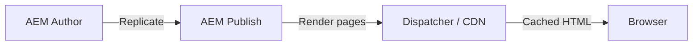

# AEM Architecture

Adobe Experience Manager được xây dựng trên ba nền tảng open-source:

- **Apache Sling** — web framework REST-based, ánh xạ URL tới content resources và resolve rendering scripts
- **Apache Jackrabbit Oak** — implementation của JCR (Java Content Repository), lưu toàn bộ content dưới dạng cây nodes và properties
- **OSGi (Apache Felix)** — modular runtime, mỗi chức năng được deploy như một bundle với explicit dependencies

Triết lý cốt lõi: **everything is content**. Pages, components, templates, configurations, scripts — tất cả đều sống dưới dạng nodes trong JCR. Cây content duy nhất này điều khiển URL resolution, rendering, và access control.

---

## 1. High-Level Architecture

Một deployment AEM điển hình gồm 3 tầng:



### Content flow

1. Author tạo hoặc chỉnh sửa content trên **Author instance**
2. Khi được duyệt, author **activate** (replicate) content
3. Replication agent serialize content và đẩy lên một hoặc nhiều **Publish instances**
4. **Flush agent** invalidate Dispatcher cache cho các path bị ảnh hưởng
5. Request tiếp theo từ browser gây cache miss → Dispatcher fetch page mới từ Publish, cache lại, rồi serve

---

## 2. Sling Request Processing Pipeline

Đây là trái tim của AEM. Mọi HTTP request — dù render page, trả JSON, hay serve asset — đều đi qua cùng một pipeline.

### Bước 1: URL Decomposition

Sling phân tách mỗi URL thành các thành phần có cấu trúc:

```text
/content/my-site/en/home.nav.html/suffix?param=value
|_____________________| |___| |__| |_____| |________|
     resource path     selectors ext suffix   query
```

| Thành phần | Ví dụ | Ý nghĩa |
|---|---|---|
| Resource path | `/content/my-site/en/home` | Path tới JCR node |
| Selectors | `nav` | Chọn rendering script cụ thể |
| Extension | `html` | Xác định output format (`html`, `json`, `xml`) |
| Suffix | `/suffix` | Thêm thông tin ngữ cảnh |
| Query | `param=value` | Query parameters |

### Bước 2: Resource Resolution

`ResourceResolver` ánh xạ URL path tới JCR node. Resolution tuân theo nhiều lớp mapping:

1. **`/etc/map` mappings** — rewrite rules trong repository (ví dụ: strip `/content/my-site` khỏi external URLs)
2. **`sling:alias`** — property trên node cung cấp URL segment thay thế
3. **Vanity URLs** — `sling:vanityPath` property tạo shortcut (ví dụ `/promo` → `/content/my-site/en/campaigns/summer`)
4. **Direct path** — nếu không có mapping nào khớp, resolve trực tiếp theo JCR tree

Kết quả là một `Resource` object bọc JCR node và expose các properties của nó.

::: tip
Dùng `/etc/map` để shorten URL theo từng environment (ví dụ strip `/content/my-site/en` trên publish) thay vì hardcode URL rút gọn trong code. Điều này giữ cho Author và Publish config độc lập nhau.
:::

### Bước 3: Script và Servlet Resolution

Sau khi tìm được resource, Sling đọc property `sling:resourceType` để locate rendering script hoặc servlet. Resolution theo thứ tự ưu tiên:

```text
Resource: sling:resourceType = "myproject/components/page"
Selectors: [nav]
Extension: html

Thứ tự tìm kiếm (first match wins):
1. /apps/myproject/components/page/nav.html
2. /apps/myproject/components/page/nav/nav.html
3. /apps/myproject/components/page/page.html       (fallback tên component)
4. /libs/myproject/components/page/nav.html         (/libs là fallback)
5. sling:resourceSuperType chain                    (kế thừa component cha)
```

**Quy tắc quan trọng:**
- `/apps` luôn được tìm trước `/libs` — đây là cơ chế của overlays và customizations
- Selectors làm hẹp script selection: `nav.html` ưu tiên hơn `page.html` khi selector `.nav` có mặt
- `sling:resourceSuperType` chain cho phép component inheritance

### Bước 4: Rendering

HTL template được thực thi:

1. `data-sly-use` khởi tạo Sling Models (hoặc Use-objects khác)
2. Sling Models được adapt từ request hoặc resource, inject properties qua annotations
3. HTL expression language render model data thành HTML
4. `data-sly-resource` triggers nested resource resolution cho child components
5. HTML response hoàn chỉnh được trả về client

---

## 3. Content Model (JCR Repository)

Toàn bộ content trong AEM được lưu dưới dạng cây nodes và properties trong JCR.

### Các node type phổ biến

| Node type | Dùng cho |
|---|---|
| `cq:Page` | Page trong content tree |
| `jcr:content` | Child node chứa authored content của page |
| `nt:unstructured` | Component instances, flexible content nodes |
| `dam:Asset` | Asset trong DAM |
| `cq:Component` | Component definition trong `/apps` |
| `cq:Template` | Template definition |
| `rep:User` / `rep:Group` | User/Group trong security |

### Cấu trúc của một Page

```text
/content/my-site/en/home (cq:Page)
└── jcr:content (cq:PageContent)
    ├── jcr:title = "Home"
    ├── cq:template = "/conf/my-site/settings/wcm/templates/page"
    ├── sling:resourceType = "myproject/components/page"
    └── root (nt:unstructured — responsivegrid)
        └── container (nt:unstructured)
            ├── text (nt:unstructured, sling:resourceType=myproject/components/text)
            │   └── text = "<p>Hello World</p>"
            └── image (nt:unstructured, sling:resourceType=myproject/components/image)
                └── fileReference = "/content/dam/my-site/hero.jpg"
```

- Node `cq:Page` chứa rất ít data — chỉ là page structure
- Toàn bộ authored content nằm trên `jcr:content` và descendants
- Mỗi component instance là một child node dưới layout container, với `sling:resourceType` và authored properties riêng

### Các kiểu giá trị Property

| JCR type | Java type | Ví dụ |
|---|---|---|
| `String` | `String` | `jcr:title = "My Page"` |
| `Long` | `Long` | `maxItems = 5` |
| `Double` | `Double` | `price = 19.99` |
| `Boolean` | `Boolean` | `hideInNav = true` |
| `Date` | `Calendar` | `cq:lastModified = 2025-03-15T...` |
| `Binary` | `InputStream` | Asset binary data |
| `String[]` / `Long[]` | Array | `cq:tags = ["topic:news", "topic:tech"]` |

### Content hierarchy là URL structure

JCR tree ánh xạ trực tiếp thành URLs:

```text
/content/my-site/en/about/team
    → https://www.my-site.com/en/about/team.html
```

Điều này có nghĩa là quyết định kiến trúc content (site structure, language copies, page hierarchy) ảnh hưởng trực tiếp tới URL scheme. **Lên kế hoạch content tree cẩn thận** — restructuring về sau đòi hỏi redirects và có thể phá vỡ SEO.

---

## 4. Component Architecture

AEM components theo pattern giống MVC, với roles được chia ra 4 artifacts:

| Artifact | File | Vai trò |
|---|---|---|
| **Dialog** | `_cq_dialog/.content.xml` | Định nghĩa author UI — form fields cho content author |
| **Sling Model** | `.java` | Đọc data từ JCR, xử lý business logic |
| **HTL Template** | `.html` | Render output từ model data |
| **Component node** | `.content.xml` trong `/apps` | Metadata: title, group, resourceType |

### Ví dụ component tối giản

**Dialog** (định nghĩa author có thể cấu hình gì):

```xml
<textfield
    jcr:primaryType="nt:unstructured"
    sling:resourceType="granite/ui/components/coral/foundation/form/textfield"
    fieldLabel="Greeting Text"
    name="./greetingText"/>
```

**Sling Model** (đọc data, xử lý logic):

```java
@Model(
    adaptables = SlingHttpServletRequest.class,
    adapters = GreetingModel.class,
    resourceType = "myproject/components/greeting",
    defaultInjectionStrategy = DefaultInjectionStrategy.OPTIONAL
)
public class GreetingModel {

    @ValueMapValue
    private String greetingText;

    public String getGreetingText() {
        return StringUtils.defaultIfBlank(greetingText, "Hello, World!");
    }

    public boolean isEmpty() {
        return StringUtils.isBlank(greetingText);
    }
}
```

**HTL Template** (render output):

```html
<sly data-sly-use.model="com.example.core.models.GreetingModel"/>
<div data-sly-test="${!model.empty}" class="greeting">
    <p>${model.greetingText}</p>
</div>
<div data-sly-test="${model.empty && wcmmode.edit}" class="cq-placeholder">
    Click to configure greeting
</div>
```

### Khi nào dùng Use-object nào

**Luôn ưu tiên Sling Models** — đây là approach được Adobe và community khuyến nghị.

::: warning Legacy: WCMUsePojo
Các codebase cũ có thể vẫn dùng `WCMUsePojo` (extend class, override `activate()`, lookup properties thủ công). Nó ra đời trước Sling Models, không có dependency injection, khó unit test, và **không nên dùng trong code mới**. Nếu kế thừa project dùng nó, migrate sang Sling Models khi chạm vào từng component.
:::

---

## 5. Data Input

Content đi vào AEM qua nhiều kênh:

### Author UI (chính)

- **Page Editor** — drag-and-drop components, inline editing, Touch UI dialogs
- **Content Fragment Editor** — structured content authoring với predefined models
- **Experience Fragment Editor** — reusable experience building blocks (header, footer, promo)
- **DAM** — asset upload, metadata editing, processing profiles, Smart Tags

### Programmatic Input

**SlingPostServlet** — built-in POST handler của AEM:

```bash
# Dev only — không dùng admin:admin ngoài local instance
curl -u admin:admin \
  -d "title=Updated Title" \
  http://localhost:4502/content/my-site/en/home/jcr:content
```

Các kênh khác:
- **Assets HTTP API** — REST API cho CRUD operations trên DAM assets
- **Content Fragment API** — tạo, update, quản lý Content Fragments programmatically
- **Package Manager** — import `.zip` content packages (hữu ích cho migrations)
- **Groovy Console** — chạy scripts cho bulk content operations

::: danger
`SlingPostServlet` rất mạnh nhưng nguy hiểm nếu exposed trên Publish. Đảm bảo nó bị restrict qua OSGi config và blocked bởi Dispatcher trên tất cả public-facing instances.
:::

---

## 6. Data Retrieval

### Sling Resource API (khuyến nghị)

API cấp cao nhất. Làm việc với `Resource` objects và `ValueMap` cho type-safe property access:

```java
// Lấy resource
Resource pageContent = resourceResolver.getResource(
    "/content/my-site/en/home/jcr:content"
);

// Đọc properties qua ValueMap
ValueMap props = pageContent.getValueMap();
String title = props.get("jcr:title", "Untitled");
String[] tags = props.get("cq:tags", String[].class);

// Navigate children
Resource root = pageContent.getChild("root");
if (root != null) {
    for (Resource child : root.getChildren()) {
        String resourceType = child.getValueMap().get("sling:resourceType", "");
    }
}

// Adapt sang higher-level APIs
Page page = pageContent.getParent().adaptTo(Page.class);
Asset asset = damResource.adaptTo(Asset.class);
```

### JCR API (lower level)

Truy cập JCR node và property trực tiếp. Dùng khi cần transactions, observation, hoặc node-type-specific operations:

```java
Session session = resourceResolver.adaptTo(Session.class);
Node node = session.getNode("/content/my-site/en/home/jcr:content");
String title = node.getProperty("jcr:title").getString();

node.setProperty("jcr:title", "New Title");
session.save();
```

### QueryBuilder API

AEM's predicate-based query API. Trả về Resource-based results và hỗ trợ pagination:

```java
Map<String, String> params = new HashMap<>();
params.put("path", "/content/my-site");
params.put("type", "cq:Page");
params.put("property", "jcr:content/cq:template");
params.put("property.value", "/conf/my-site/settings/wcm/templates/article");
params.put("orderby", "@jcr:content/cq:lastModified");
params.put("orderby.sort", "desc");
params.put("p.limit", "10");
params.put("p.offset", "0");

Query query = queryBuilder.createQuery(PredicateGroup.create(params), session);
SearchResult result = query.getResult();
for (Hit hit : result.getHits()) {
    Resource resource = hit.getResource();
}
```

### JCR-SQL2

SQL-like query language cho complex queries, đặc biệt là joins:

```sql
SELECT page.[jcr:path], content.[jcr:title]
FROM [cq:Page] AS page
INNER JOIN [nt:unstructured] AS content ON ISCHILDNODE(content, page)
WHERE ISDESCENDANTNODE(page, '/content/my-site')
  AND content.[cq:template] = '/conf/my-site/settings/wcm/templates/article'
  AND content.[jcr:title] IS NOT NULL
ORDER BY content.[cq:lastModified] DESC
```

::: warning
Mọi query phải có Oak index hỗ trợ. Query gây index traversal cực kỳ chậm và sẽ log `WARN: Traversed 10000 nodes`. Kiểm tra query plan bằng `EXPLAIN` và tạo custom Oak indexes cho production queries.
:::

### Sling Model Exporter

Export component data dưới dạng JSON mà không cần viết custom servlet:

```java
@Model(
    adaptables = SlingHttpServletRequest.class,
    adapters = {ArticleModel.class, ComponentExporter.class},
    resourceType = "myproject/components/article",
    defaultInjectionStrategy = DefaultInjectionStrategy.OPTIONAL
)
@Exporter(name = "jackson", extensions = "json")
public class ArticleModel implements ComponentExporter {

    @ValueMapValue private String title;
    @ValueMapValue private String summary;

    public String getTitle()   { return title; }
    public String getSummary() { return summary; }

    @Override
    public String getExportedType() { return "myproject/components/article"; }
}
```

Request tới `/content/my-site/en/home.model.json` sẽ trả về page's component data dưới dạng JSON.

---

## 7. OSGi Services và Dependency Injection

Business logic dùng chung giữa components, servlets, hoặc workflows nên nằm trong **OSGi services**.

### Service basics

```java
// Định nghĩa service interface
public interface PricingService {
    String formatPrice(double amount, String locale);
}

// Implement như OSGi component
@Component(service = PricingService.class)
public class PricingServiceImpl implements PricingService {

    @Reference
    private ExchangeRateService exchangeRateService;

    @Override
    public String formatPrice(double amount, String locale) {
        return formatted;
    }
}
```

Inject vào Sling Model:

```java
@Model(adaptables = SlingHttpServletRequest.class)
public class ProductModel {

    @OSGiService
    private PricingService pricingService;

    @ValueMapValue
    private double price;

    public String getFormattedPrice() {
        return pricingService.formatPrice(price, "en_US");
    }
}
```

### OSGi configuration và run modes

Config files nằm trong `ui.config` và được scope theo run mode:

```text
ui.config/src/main/content/jcr_root/apps/myproject/osgiconfig/
├── config/               ← tất cả environments
├── config.author/        ← author only
├── config.publish/       ← publish only
├── config.author.dev/    ← author + dev run mode
└── config.publish.prod/  ← publish + prod run mode
```

File cấu hình (`.cfg.json`):

```json
{
  "defaultCurrency": "EUR",
  "cacheTtlSeconds": 3600
}
```

### Service users (tránh admin sessions)

**Không bao giờ** dùng `loginAdministrative()`. Định nghĩa service user với minimal permissions:

```json
{
  "user.mapping": [
    "myproject.core:data-reader=[myproject-data-reader]"
  ]
}
```

```java
@Reference
private ResourceResolverFactory resolverFactory;

public void readContent() {
    Map<String, Object> params = Map.of(
        ResourceResolverFactory.SUBSERVICE, "data-reader"
    );
    try (ResourceResolver resolver = resolverFactory.getServiceResourceResolver(params)) {
        Resource resource = resolver.getResource("/content/my-site/data");
    } catch (LoginException e) {
        log.error("Failed to obtain service resolver", e);
    }
}
```

::: danger
Luôn dùng **try-with-resources** cho service resource resolvers. Resolver bị leak nghĩa là JCR session bị leak — cuối cùng session pool cạn kiệt và instance sập.
:::

---

## 8. Caching và Delivery

### Dispatcher Caching

Dispatcher cache rendered HTML pages dưới dạng static files trên Apache httpd filesystem:

- Cache paths: `/content/**/*.html`, assets, clientlibs
- Không cache: `/bin/*`, `/etc/*`, POST requests, requests có query params (mặc định)
- Invalidation: flush agent gửi `INVALIDATE` request → Dispatcher xóa `.stat` file → cache miss tiếp theo fetch fresh từ Publish
- Debug: kiểm tra header `X-Dispatcher` và `Cache-Control: max-age` trong response

### Sling Dynamic Include (SDI)

Với pages có mix giữa static và dynamic content (ví dụ personalized header trên page tĩnh), SDI thay thế component output bằng SSI/ESI tag ở Dispatcher level:

```text
Static page (cached by Dispatcher)
├── Header: <ssi:include src="/content/.../header.nocache.html"/> (không cache)
├── Hero: static (cached)
└── Footer: static (cached)
```

Cho phép cache 90% page trong khi dynamic fragments vẫn fresh.

### CDN Integration

Với AEM on-premise hoặc AMS, đặt CDN (CloudFront, Akamai, Fastly) trước Dispatcher và cấu hình:

- `Cache-Control` headers từ AEM/Dispatcher
- Cache invalidation API được trigger bởi replication events
- Origin shielding để giảm tải cho Publish

---

## 9. Common Pitfalls

### Dialog và Authoring

| Vấn đề | Mô tả | Cách sửa |
|---|---|---|
| Thiếu prefix `./` trong field name | Property không được persist xuống JCR | Luôn dùng `name="./myProperty"` |
| Mix Coral 2 và Coral 3 | Visual và functional inconsistencies | Dùng thuần `/components/coral/foundation` (Coral 3) |
| Không handle `null` trong Sling Models | NPE khi field không được điền | Dùng `defaultInjectionStrategy = OPTIONAL` hoặc null-safe getters |

### Resource Resolvers và Sessions

| Vấn đề | Mô tả |
|---|---|
| Close request-scoped resolver | Resolver inject qua `@SlingObject` được Sling quản lý — tự close sẽ phá vỡ components khác trong cùng request |
| Dùng request-scoped resolver trong async threads | Resolver đóng khi request kết thúc → background thread nhận `IllegalStateException` |
| Không close service resolver | Dùng `getServiceResourceResolver()` phải close thủ công — luôn dùng try-with-resources |

```java
// SAI — resolver leak nếu có exception
ResourceResolver resolver = resolverFactory.getServiceResourceResolver(params);
Resource r = resolver.getResource("/content/data");
resolver.close();

// ĐÚNG — guaranteed cleanup
try (ResourceResolver resolver = resolverFactory.getServiceResourceResolver(params)) {
    Resource r = resolver.getResource("/content/data");
}
```

### Queries và Performance

- **Query không có Oak index** — gây traversal (full scan). Luôn kiểm tra bằng `EXPLAIN SELECT ...` và tạo indexes cho production queries
- **Dùng deprecated xpath** — chuyển sang JCR-SQL2 hoặc QueryBuilder
- **`p.limit=-1` trong QueryBuilder** — trả về toàn bộ kết quả không phân trang. Ổn với dataset nhỏ, nguy hiểm với dataset lớn

### Content và URLs

- **Hardcode `/content/dam/...` paths** — dùng authored references (pathfield dialogs). Hardcoded paths vỡ khi content bị move
- **Bỏ qua `/etc/map` trên publish** — URLs hoạt động trên author sẽ 404 trên publish nếu URL mappings không được cấu hình

### Dispatcher và Caching

- **"Works on author, broken on publish"** — Dispatcher strip query params, block certain paths, cache aggressively. Luôn test với Dispatcher trong development
- **Không invalidate khi publish** — đảm bảo flush agents được cấu hình đúng cho mọi Publish instance
- **Cache personalized content** — nếu page vary theo user, dùng SDI cho dynamic fragments hoặc set `Dispatcher: no-cache` header cho path đó

---

## Tham khảo

- [Apache Sling documentation](https://sling.apache.org/documentation.html)
- [Apache Jackrabbit Oak](https://jackrabbit.apache.org/oak/docs/)
- [AEM 6.5 Architecture overview — Experience League](https://experienceleague.adobe.com/docs/experience-manager-65/content/implementing/developing/introduction/the-basics.html)
- [Oak indexes best practices](https://experienceleague.adobe.com/en/docs/experience-manager-65/content/implementing/deploying/practices/best-practices-for-queries-and-indexing)
- [Dispatcher configuration](https://experienceleague.adobe.com/docs/experience-manager-dispatcher/using/configuring/dispatcher-configuration.html)
