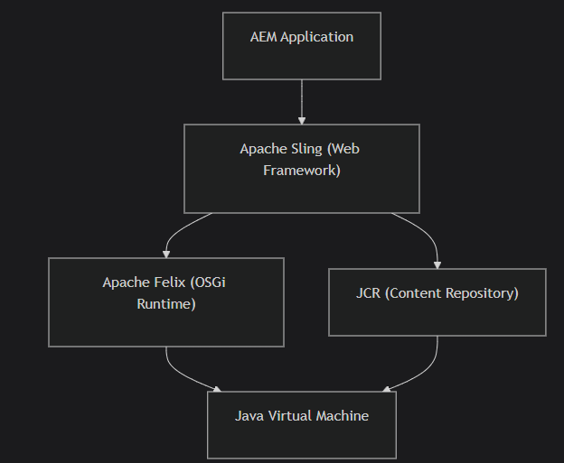
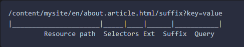

## What is AEM?

- a Content management system (CMS) built on Java to manage websites, digital assets, and content across channels.


| Layer               | What it does                                                    |
| ------------------- | --------------------------------------------------------------- |
| AEM                 | CMS feature - authoring UI, templates, workflows, assets, sites |
| Apache Sling        | Web framework - maps URLs to content, handles HTTP requests     |
| JCR                 | Content storage - a hierarchical, versioned content database    |
| OSGi (Apache Felix) | Module System - manages java bundles, services, configuration   |
| JVM                 | Runtime - everything runs on the JVM                            |

## Các loại AEM

| Variant                   | Mô tả                                                      |
| ------------------------- | ---------------------------------------------------------- |
| AEM as a Cloud Service    | Cloud-native, quản lý bởi Adobe, auto-scaling, luôn update |
| AEM 6.5 (Managed Service) | Adobe-hosted nhưng customer quản lý, update thủ công       |
| AEM 6.5 (On-premise)      | Tự hosted trên infrastructure của bạn.                     |
Những đặt điểm của AEMaaCS
- Không **CRXDE Lite trong production** - content thay đổi qua Git và Cloud Manager.
- **Imutable infrastructure** không thể modify runtime ở deploy time.
- Auto-updates - Adobe luôn date liên tục
- Cloud Manager - CI/CD pipeline cho deployment
- Rapid Development Environment (RDE) - môi trường phát triển nhanh.

## Author vs Publish


- Author: content editing, authoring UI, workflows
- Publish: Content delivery, public-facing website.

## Project Structure walkthrough

```
mysite/
├── pom.xml                    # Parent POM (reactor)
├── all/                       # Aggregates all packages for deployment
│   └── pom.xml
├── core/                      # Java code (Sling Models, services, servlets)
│   ├── pom.xml
│   └── src/main/java/
│       └── com/mysite/core/
├── ui.apps/                   # AEM components, templates, configs (JCR content)
│   ├── pom.xml
│   └── src/main/content/
│       └── jcr_root/
│           └── apps/mysite/
│               ├── components/
│               ├── clientlibs/
│               └── …
├── ui.content/                # Sample content and pages
│   ├── pom.xml
│   └── src/main/content/
│       └── jcr_root/
│           └── content/mysite/
├── ui.config/                 # OSGi configurations
│   ├── pom.xml
│   └── src/main/content/
│       └── jcr_root/
│           └── apps/mysite/osgiconfig/
├── ui.frontend/               # Frontend build (webpack/clientlibs source)
│   ├── package.json
│   └── src/
├── dispatcher/                # Dispatcher configuration
│   └── src/
│       ├── conf.d/
│       └── conf.dispatcher.d/
└── it.tests/                  # Integration tests
    └── pom.xml
```

## Module responsibilities

|Module|Contains|Deployed as|
|---|---|---|
|**core**|Java code - Sling Models, OSGi services, servlets|OSGi bundle (JAR)|
|**ui.apps**|AEM components, HTL templates, clientlibs, configs|Content package|
|**ui.content**|Sample pages, DAM assets, content structures|Content package|
|**ui.config**|OSGi configurations per run mode|Content package|
|**ui.frontend**|Frontend source (SCSS, JS) - compiled and copied to ui.apps|Not deployed directly|
|**all**|Aggregates all packages into one deployable unit|Container package|
|**dispatcher**|Apache/Dispatcher configuration|Deployed separately|
|**it.tests**|Integration tests|Run during build|

## Content package filters

Filter này kiểm soát thứ gì được deployed (gồm install và removed). Nếu dùng `mode="replace"` thì content ở path đó sẽ bị xóa và replace khi khi install.

Lệnh:

```
mvn clean install -PautoInstallSinglePackage
```

1. compile tất cả Java `core`
2. Build frontend ở `ui.frontend/`
3. Package mọi thứ vào content package
4. Deploy `all` package tới `http://localhost:4502`

- `autoInstallSinglePackagePublish` deploy to publish (4503)